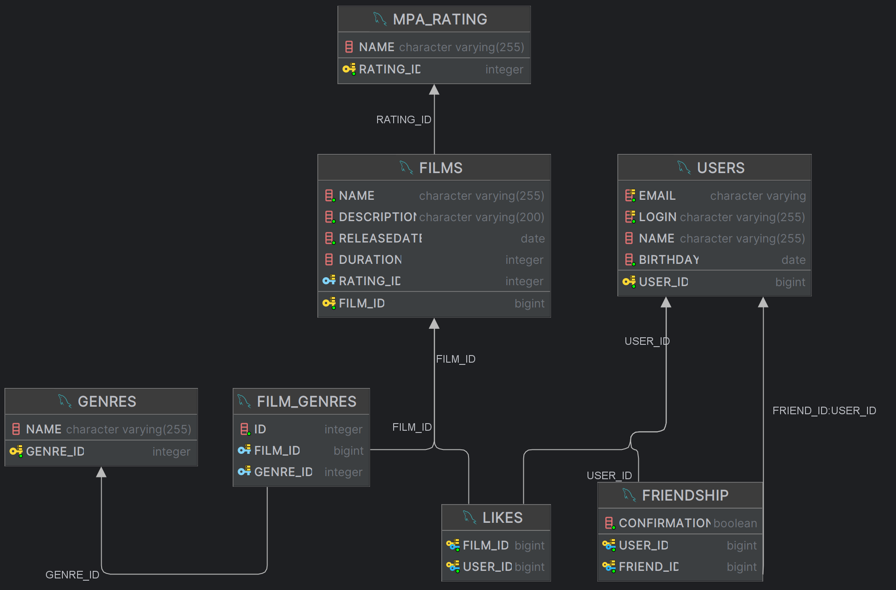

# Java-filmorate

Project realizing the backend for Filmorate app.

# Description

Stack: Java 21, REST based on Spring Boot, Maven, Lombock, H2 SQL.

ER-диаграмма:

Project has 2 main entity's:

1. Film - described Film and connected with Genre, PG rating and Likes.
2. User - user of filmorate app. Connected to Likes for Film and his Friends.

Users also can add friends and watch list of films which were liked by his friends.

Application developed as standard REST architecture based on Spring Boot.
DB realized via H2 SQL and can be stored in the file on PC.

